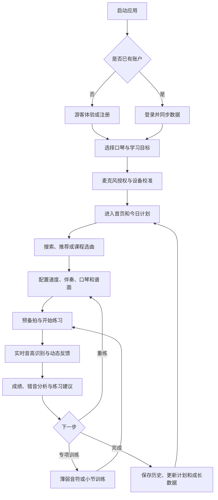

# 口琴练习室（Harmonica Practice App）

面向口琴初学者与进阶练习者的移动端练习应用。项目希望把选曲、练习准备、动态跟谱、音高识别、演奏评分和长期成长记录连接成一条完整学习路径，让用户不仅“知道该吹哪个音”，还能够看到自己的节奏、音准和稳定性如何变化。

当前代码由 Figma 高保真设计稿演进而来，使用 React、TypeScript、Vite 和 Tailwind CSS 构建。

> 当前版本已完成七阶段路线的第 1–4 阶段，并推进第 5 阶段“真实音频与录音”和第 6 阶段“合规与发布质量”。项目已具备 SQLite API、云端账户、短时访问令牌、HttpOnly 刷新令牌轮换、密码重置邮件、账户注销、增量历史同步、录音回放、上传音频识谱、临时练习谱和基础隐私控制；算法仍需真实设备校准，生产部署、正式法律文本、原曲授权谱面与版权伴奏尚未接入，因此还不能视为正式发布版本。

## 项目核心特点

- **游戏化练习**：通过动态下落音符、判定线、连击和实时得分降低读谱门槛。
- **口琴专属指引**：同时显示孔位、吹吸方向、简谱音高与十孔口琴布局。
- **可调节训练节奏**：练习速度支持 50%–120%，实际影响练习 BPM 和音符推进速度。
- **即时反馈**：展示 Perfect、Great、Good、Bad、Miss 判定，以及准确率和最高连击。
- **完整练习闭环**：从曲库筛选、练习设置、演奏过程到结果分析和最近记录形成完整路径。
- **面向多种口琴**：产品规划覆盖十孔布鲁斯口琴与半音阶口琴。
- **移动优先**：桌面端以设备外框展示，小屏设备自动使用全屏布局。
- **可访问性支持**：包含键盘焦点、按钮语义、状态说明和减少动画偏好支持。

## 功能状态说明

- ✅ 已实现：当前代码中可以直接使用。
- 🧪 原型功能：交互已存在，但底层数据或算法仍为模拟实现。
- 🗓️ 规划功能：完整产品流程所需，尚未接入当前代码。

## 当前已实现的功能

### 1. 曲库首页

- ✅ 展示歌曲名称、作者、调性、BPM、难度、曲风和适用口琴类型。
- ✅ 支持按歌曲名称、歌手和调性搜索。
- ✅ 支持按十孔、半音阶口琴筛选。
- ✅ 支持按流行、经典、民谣、动漫、古典、轻音乐等曲风筛选。
- ✅ 显示当前结果数量。
- ✅ 无匹配结果时展示空状态，并可一键重置筛选。
- ✅ 点击歌曲进入练习准备页。
- ✅ 展示本机最近练习记录，并可从记录重新进入对应曲目。

### 2. 练习准备

- ✅ 展示歌曲封面风格、名称、作者、调性、原始 BPM 和难度。
- ✅ 练习速度支持 50%–120% 调整。
- ✅ 速度设置会换算成实际练习 BPM。
- ✅ 可选择合成练习和弦、简化根音或无伴奏。
- ✅ 可选择十孔或半音阶口琴。
- ✅ 可选择动态下落或传统乐谱模式。
- ✅ 可设置整曲/A 段/B 段、自定义 A-B 小节和 1–3 次区间重复。
- ✅ 可设置伴奏、节拍器和示范音量。
- 🧪 可上传 MP3/WAV/M4A 等音频并生成简谱草稿，还可一键转换为临时练习谱进入练习；复杂伴奏、人声或多声部音频仍需人工校对。

### 3. 练习过程

- ✅ 动态下落音符与判定线。
- ✅ 两行传统简谱预览、当前音符高亮和跟随移动。
- ✅ 当前孔位、吹气/吸气方向提示。
- ✅ 十孔/半音阶孔位条、当前孔位高亮和长条音符下落。
- ✅ 练习进度、实时分数、准确率和连击显示。
- ✅ 开始、暂停、继续和重新开始。
- ✅ 暂停后继续不会跳过暂停期间的进度。
- ✅ 支持整曲、前半段 A 段和后半段 B 段练习。
- ✅ 所选区间可重复 1–3 次，每轮独立计分并汇总结果。
- ✅ 可自定义任意起止小节作为 A-B 练习范围，并自动校验边界。
- ✅ 节拍器随实际 BPM 发声，小节首拍使用重音，可在练习中开关。
- ✅ 合成练习和弦/简化根音与练习时钟同步，可在练习中独立静音。
- ✅ 麦克风开关；关闭后音符会按未命中处理。
- ✅ 用户主动开始练习后请求麦克风权限，并通过 Web Audio API 采集输入。
- ✅ 开始练习前采样环境底噪，生成动态噪声门限，并显示校准进度与输入电平。
- ✅ 实时计算频率、音名、音分偏差、输入置信度和音高稳定度，并用于综合判定。
- ✅ 识别匹配音符的起音时间，统计提前/延后偏差，并对明显失拍或不稳定音符降级。
- ✅ 支持权限拒绝、无输入设备、浏览器不支持和一般启动错误状态。
- ✅ 麦克风关闭或没有稳定输入时按未命中处理，不再生成随机成绩。
- ✅ 已建立 v2 版本化谱面 Schema、运行时校验和 v1 迁移能力。
- ✅ 歌曲 1、2、3 各有独立 12 小节十孔练习编配，歌曲 7 有独立半音阶技巧练习；其他歌曲仍回退到基础谱。
- ✅ 谱面支持自然音、半音/全音压音、超吹与半音阶滑键技巧标记，练习界面会显示对应提示。

### 4. 成绩与反馈

- ✅ 根据准确率生成 S、A、B、C、D 评级。
- ✅ 展示最终分数、准确率、完成度和最高连击。
- ✅ 展示各类判定数量和占比。
- ✅ 提供基础练习评价。
- ✅ 支持重新练习和返回曲库。
- ✅ 支持系统分享；不支持时尝试复制成绩文本。
- ✅ 练习结果保存到浏览器 `localStorage`，最多保留最近 20 条。
- ✅ 保存每个音符的目标音、孔位、吹吸、判定、检测音名和音分偏差。
- ✅ 自动汇总最薄弱小节，并展示最多 8 条明显错音。
- ✅ 可将最弱小节收藏为难点专项。
- ✅ 展示平均节奏偏差、提前/延后次数和平均音高稳定度。

### 5. 界面与体验

- ✅ 响应式移动端布局。
- ✅ 桌面端设备预览外框。
- ✅ 中文页面标题、描述和主题色。
- ✅ 图标按钮具有辅助说明。
- ✅ 筛选选项具有选中状态语义。
- ✅ 支持 `prefers-reduced-motion`，减少不必要动画。

### 6. 账户、云同步与个人设置

- ✅ 首次进入支持注册、登录或游客体验。
- ✅ 本地账户使用 PBKDF2-SHA-256 加盐派生密码校验值，不保存明文密码。
- ✅ 本机会话恢复、退出登录和删除本地账户。
- ✅ 游客练习记录在注册或登录后自动迁移到账户空间。
- ✅ 可修改昵称、默认口琴、当前水平和每日练习目标。
- ✅ 支持将个人资料与练习历史导出为 JSON。
- ✅ 配置 `VITE_API_URL` 后启用云端注册、登录、会话恢复、资料修改和账户注销。
- ✅ 云端密码使用 scrypt 加盐哈希；访问令牌有效期 15 分钟，刷新令牌保存在 HttpOnly Cookie 并在使用后轮换。
- ✅ 支持一次性、15 分钟有效的密码重置令牌，生产环境通过 SMTP 发送重置链接。
- ✅ 练习历史支持 SQLite 持久化、增量拉取、revision 乐观并发控制和冲突合并。
- ✅ 未配置云端时继续使用本地账户和离线游客模式。

### 7. 学习中心与历史分析

- ✅ 根据账户偏好显示每日练习分钟目标和完成进度。
- ✅ 统计累计练习次数、平均准确率、最高分和连续练习天数。
- ✅ 展示最近 7 天练习分钟趋势。
- ✅ 保存新练习的实际持续时长，并兼容旧版历史数据。
- ✅ 根据历史准确率推荐需要巩固的曲目。
- ✅ 提供入门、节奏与音准挑战三条分级课程路径。
- ✅ 根据课程练习次数计算进度，并跳转到下一首推荐曲目。
- ✅ 历史页展示每次练习的曲目、时间、时长、得分和准确率。
- ✅ 展示已收藏的难点小节，一键以 80% 速度循环 3 次复练。
- ✅ 难点专项支持游客到本地账户迁移，并包含在数据导出中。

## 完整产品功能规划

### 1. 注册、登录与账户安全

- ✅ 游客模式：无需注册即可体验基础练习，注册后可迁移本地数据。
- ✅ 邮箱和密码支持本地离线账户与 SQLite 云端账户两种模式。
- 🗓️ 手机号注册、验证码验证和快捷登录。
- 🗓️ 微信、Apple、Google 等第三方登录，可按发布平台选择接入。
- ✅ 支持退出登录、忘记密码、一次性重置链接和密码变更后全部设备下线。
- ✅ Access Token / Refresh Token 会话管理、自动刷新、令牌轮换和重放检测。
- 🧪 已增加麦克风/上传音频/练习录音的数据处理说明和隐私状态清单；正式用户协议与隐私政策仍待发布前补齐。
- ✅ 本地账户与云端账户注销已实现；JSON 导出当前基于本机同步缓存。

### 2. 首次使用与新手引导

- 🗓️ 选择练习目标：入门、识谱、音准、节奏、曲目演奏或考级。
- 🗓️ 选择持有的口琴类型、调性和熟练程度。
- 🗓️ 麦克风权限申请与用途说明。
- 🗓️ 环境噪声检测、输入音量检查和基准音校准。
- 🗓️ 吹吸、孔位、动态谱面和判定机制的新手教程。
- 🗓️ 制定每日练习时长和提醒时间。

### 3. 首页与学习计划

- ✅ 每日分钟目标、连续练习天数和最近 7 天趋势。
- 🧪 根据历史准确率推荐需要巩固的歌曲；音符级薄弱分析待完善。
- 🗓️ 收藏、最近播放、已下载和自建歌单。
- 🗓️ 新手课程、专项训练、每日挑战和活动入口。
- ✅ 跨设备同步最近练习历史；课程进度和收藏同步仍待扩展。

### 4. 曲库与课程体系

- 🗓️ 按难度、曲风、调性、BPM、口琴类型和是否收藏组合筛选。
- 🗓️ 曲目详情、试听、谱面预览、目标技能和预计练习时长。
- 🧪 已有 4 份独立练习编配及简谱、节拍、孔位、吹吸和技巧数据；其余曲目待补齐。
- 🧪 已实现整曲/A 段/B 段、自定义 A-B 小节和 1–3 次区间重复；难点小节收藏待完善。
- 🗓️ 课程章节、学习解锁、课后练习和阶段测评。
- 🗓️ 离线下载谱面与伴奏。

### 5. 真实演奏识别

- ✅ 基于 Web Audio API 采集麦克风输入。
- ✅ 基频检测、音名转换、音分偏差计算和基础置信度分析。
- 🗓️ 噪声门、输入增益、延迟补偿和不同设备校准。
- 🗓️ 针对十孔口琴的吹吸、压音、超吹识别。
- 🧪 已有半音阶滑键、孔位和音高映射数据；真实滑键动作识别仍待实现。
- 🗓️ 根据音准、节奏、持续时长和稳定性生成真实判定。
- 🗓️ 识别失败、权限拒绝和输入设备中断的降级处理。

### 6. 伴奏与播放控制

- ✅ 合成练习和弦、简化根音和无伴奏模式。
- ✅ 基础节拍器已实现，并与变速后的练习 BPM 同步。
- ✅ 合成伴奏与分段、循环、变速和暂停共用练习时钟。
- 🧪 已建立音频资源注册表，区分合成资源、原曲版权伴奏和教师示范音轨授权状态。
- 🧪 支持上传本地音频进行单旋律音高分析，映射为当前调性的简谱草稿，并生成可练习的临时谱面。
- 🧪 已显示音画同步计划、播放倍率、分段循环与实际练习 BPM。
- ✅ 已支持伴奏、节拍器和示范音量的独立设置；麦克风监听音量仍待实现。
- 🗓️ 原曲版权伴奏、教师示范音轨和真实音频变速需接入授权音频文件。
- 🗓️ 倒计时、预备拍、变速不变调和真实音频波形同步。
- 🗓️ 耳机模式、扬声器模式和蓝牙延迟校准。
- 🗓️ 自动暂停、后台恢复和音频焦点处理。

### 7. 成绩分析与成长体系

- 🧪 已按音符和小节展示音准偏差、错音分布、节奏和稳定性维度。
- ✅ 支持本次练习录音回放，并可跳转到明显错音片段。
- 🧪 已实现本地周趋势和练习时长统计；周报、月报待完善。
- 🧪 已实现最弱小节识别、错音明细和一键专项复练；长期薄弱孔位统计待完善。
- 🗓️ 经验值、等级、徽章、连续练习和挑战任务。
- 🗓️ 成绩卡图片生成、隐私控制和社交分享。

### 8. 个人中心与设置

- 🗓️ 头像、昵称、个人简介和默认口琴设置。
- 🗓️ 每日目标、练习提醒和通知管理。
- 🗓️ 音频设备、麦克风灵敏度、判定宽松度和延迟校准。
- 🧪 已支持键盘焦点、减少动画偏好和练习状态播报；字体大小、主题切换和更多无障碍设置待完善。
- 🗓️ 云同步、缓存、离线内容和存储空间管理。
- 🗓️ 反馈、帮助中心、版本信息和隐私管理。

### 9. 后台运营与内容管理

- 🗓️ 用户、曲目、谱面、伴奏和课程内容管理。
- 🗓️ 曲目版本审核、版权来源和授权状态管理。
- 🗓️ 推荐位、活动、公告、消息和练习任务配置。
- 🗓️ 用户反馈、异常识别日志和设备兼容性统计。
- 🗓️ 数据看板、留存、练习完成率和内容转化分析。

## 用户完整流程



## 页面规划

| 页面 | 当前状态 | 主要职责 |
| --- | --- | --- |
| 启动页 | 🗓️ | 初始化、会话恢复、资源检查 |
| 注册/登录 | ✅ | 本地/云端邮箱账户、游客入口、密码找回和安全会话 |
| 新手引导 | 🗓️ | 学习目标、口琴类型、权限与设备校准 |
| 曲库首页 | ✅ | 搜索、筛选、最近练习、选曲 |
| 曲目详情 | 部分实现 | 曲目信息、试听、谱面与练习入口 |
| 练习准备 | ✅/🧪 | 速度、伴奏、口琴与谱面设置 |
| 实时练习 | 🧪 | 跟谱、识别、判定和播放控制 |
| 练习结果 | ✅/🧪 | 成绩、判定统计、建议和分享 |
| 练习历史 | ✅/🧪 | 本地缓存、云端增量同步、冲突处理和周趋势；录音当前为本次结果页临时回放 |
| 学习计划 | 🧪 | 每日目标、连续练习、课程进度和巩固推荐 |
| 个人中心 | 🧪 | 本地资料、练习偏好、数据导出和账户管理 |
| 运营后台 | 🗓️ | 用户、内容、版权、活动和数据管理 |

## 技术栈

- **应用框架**：React 18、TypeScript
- **构建工具**：Vite 6
- **样式系统**：Tailwind CSS 4、CSS 变量、响应式 CSS
- **交互组件**：Radix UI、Lucide React
- **动画**：Motion
- **数据存储**：离线模式使用浏览器 `localStorage`；云端模式使用 SQLite，前端保留可恢复的本地缓存
- **后端 API**：Express、Zod、Helmet、CORS、限流与 SQL.js/SQLite
- **身份安全**：服务端 scrypt 密码哈希、JOSE JWT、HttpOnly/SameSite 刷新 Cookie、轮换与重放撤销
- **音频能力**：Web Audio API、自相关基础音高检测；后续计划迁移高负载分析到 AudioWorklet
- **生产演进建议**：多实例部署时迁移 PostgreSQL，并使用 Redis 处理限流、验证码和高频会话状态
- **建议对象存储**：用于伴奏、谱面资源、头像和用户录音

## 项目结构

```text
.
├─ index.html                     # HTML 入口和页面元信息
├─ server/                        # Express API、SQLite、认证、邮件与 API 测试
├─ src/
│  ├─ main.tsx                    # React 挂载入口
│  ├─ app/
│  │  ├─ App.tsx                  # 页面流转、练习状态和本地历史
│  │  ├─ auth/                    # 本地认证、会话与密码校验原型
│  │  ├─ cloud/                   # 云端认证、令牌刷新和历史同步客户端
│  │  ├─ learning/                # 学习统计、连续练习和趋势计算
│  │  ├─ practice/                # 分段循环、弱项分析和专项训练逻辑
│  │  ├─ data.ts                  # 演示曲库数据
│  │  ├─ data/learningTracks.ts   # 分级课程路径配置
│  │  ├─ types.ts                 # 核心数据类型
│  │  └─ components/
│  │     ├─ HomePage.tsx          # 曲库首页
│  │     ├─ AuthPage.tsx          # 注册、登录与游客入口
│  │     ├─ AccountPage.tsx       # 个人资料、偏好和数据管理
│  │     ├─ LearningPage.tsx      # 学习计划、课程和历史趋势
│  │     ├─ PrepPage.tsx          # 练习准备
│  │     ├─ PracticePage.tsx      # 实时练习原型
│  │     ├─ ResultsPage.tsx       # 练习结果
│  │     └─ ui/                   # 通用 UI 组件
│  └─ styles/                     # 主题、Tailwind 和全局样式
├─ guidelines/                    # 设计与生成规范
├─ .env.example                   # 前后端云模式环境变量模板
└─ ATTRIBUTIONS.md                # 第三方资源说明
```

## 本地开发

### 环境要求

- Node.js 18 或更高版本
- npm 9 或更高版本
- 建议使用最新版 Chrome、Edge 或 Safari 测试麦克风相关能力

### 安装依赖

```bash
npm install
```

### 启动开发服务器

```bash
npm run dev
```

Vite 会在终端输出本地访问地址，通常为 `http://localhost:5173`。

### 启用云端模式

复制 `.env.example` 为 `.env`，至少设置一个 32 字符以上的随机 `JWT_SECRET`，然后分别启动：

```bash
npm run dev:api
npm run dev
```

浏览器端检测到 `VITE_API_URL` 后会使用云端账户与历史同步；移除该变量后仍可使用本地账户。生产环境必须配置 SMTP 参数，开发环境会在忘记密码接口中返回测试用重置令牌。

主要 API：`/api/health`、`/api/auth/register`、`/api/auth/login`、`/api/auth/refresh`、`/api/auth/forgot-password`、`/api/auth/reset-password`、`/api/auth/me`、`/api/history` 和 `/api/history/sync`。

### 生产构建

```bash
npm run build
```

构建产物位于 `dist/`。

### 自动化测试

```bash
npm test
npm run test:components
npm run test:e2e
```

当前测试覆盖 G3–D5 PCM 音域、噪声和谐波回归、静音与动态门限、浏览器音频能力、账户、学习统计、分段循环、错音分析、谱面校验、首页筛选和练习准备。关键游客流程会在本机 Chrome 与 Edge 的移动端视口执行 E2E。

提交或发布前可运行统一质量门禁：

```bash
npm run quality
```

该命令依次执行严格类型检查、Lint、质量/隐私/兼容性等 Node/API 单元与集成测试、组件测试、跨浏览器 E2E、生产构建和性能预算检查。

也可以单独检查生产包体预算：

```bash
npm run check:budget
```

当前预算为首屏 JS 不超过 450KB、CSS 不超过 110KB；超过阈值时脚本会以失败状态退出，方便后续接入 CI。

发布前还可以运行发布就绪检查：

```bash
npm run check:release
```

该脚本会确认 README、授权说明、环境变量模板、发布检查清单、回滚计划、GitHub Actions 工作流和生产构建产物是否齐全。

## CI/CD 与发布流程

- GitHub Actions 已配置 `.github/workflows/ci.yml`，在推送到 `main`、向 `main` 发起 Pull Request 或手动触发时运行。
- CI 使用 Node.js 22 和 `npm ci` 安装锁定依赖，随后安装 Playwright 浏览器并执行 `npm run quality`。
- CI 会在结束时上传 `dist/` 构建产物；E2E 失败时上传 Playwright 报告，便于排查。
- 发布前按 `docs/RELEASE_CHECKLIST.md` 逐项确认代码质量、环境密钥、内容版权、隐私合规和发布后观察项。
- 出现严重故障时按 `docs/ROLLBACK_PLAN.md` 回退到最近稳定版本，并保留事故记录。

## 数据与隐私原则

- 游客和本地账户记录仅保存在浏览器；云端账户会同步练习摘要、分数、准确率、时长和薄弱小节。
- 界面应持续明确区分本地数据、云端数据和未来可能产生的用户录音。
- 采集麦克风前必须展示用途并获得用户授权。
- 上传音频识谱默认在本机浏览器内解码和分析，界面要求用户确认本地处理说明。
- 用户录音默认不上传，当前仅生成本次结果页临时回放；如需云端分析，应提供单独授权和删除机制。
- 云端访问令牌仅保存在内存，刷新令牌使用 HttpOnly/SameSite Cookie，不写入 `localStorage`。
- 已提供数据导出和账户注销能力；正式隐私政策、用户协议、版本号和生效日期仍需补齐。

## 无障碍与兼容性原则

- 移动端优先使用 `100dvh`/`100svh` 与窄屏全屏布局，桌面端使用手机外框预览。
- 按钮、输入框、选择框、音频控件和可聚焦元素应提供清晰 `focus-visible` 样式。
- 用户启用减少动画偏好时，应尽量关闭或缩短动画和过渡。
- 练习页应向屏幕阅读器播报当前目标音、孔位、吹吸方向、分数和判定。
- 当前 E2E 覆盖 Chrome 与 Edge 移动视口；Safari、Firefox、真机麦克风和不同屏幕尺寸仍需专项测试。

## 性能与异常恢复原则

- 发布前通过 `npm run check:budget` 检查生产构建体积，避免移动端首屏资源持续膨胀。
- 音频识别仍以主线程 Web Audio 原型为主，当前以每帧分析耗时预算进行约束；正式版建议迁移高负载分析到 AudioWorklet 或 Worker。
- 应用入口已接入全局异常监听，会记录脚本错误、未处理异步错误和基础页面加载性能事件。
- React 渲染错误由错误边界兜底，用户可尝试恢复页面，避免白屏卡死。
- 当前监控事件仅保存在本地内存缓冲区，不上传第三方服务；正式发布前仍需选择监控平台、脱敏策略和用户授权说明。

## 建议开发阶段

### 七阶段 × 三子阶段执行路线

后续开发严格按下表顺序推进。每完成一个大阶段，会先提交实现、验证结果和已知风险总结，再进入下一阶段。

| 大阶段 | 子阶段 1 | 子阶段 2 | 子阶段 3 | 状态 |
| --- | --- | --- | --- | --- |
| 1. 音频识别可靠性 | 麦克风底噪校准、输入电平与动态门限 | 起音识别、提前/延后节奏偏差 | 音高稳定度、综合判定与结果分析 | ✅ 已完成 |
| 2. 曲谱与内容完整性 | 谱面 Schema、校验和迁移工具 | 至少 3 首独立完整练习编配 | 半音阶口琴与进阶技巧数据 | ✅ 已完成 |
| 3. 工程质量 | TypeScript 严格检查与 Lint | 组件测试和关键流程 E2E | 音频样本回归与兼容性测试 | ✅ 已完成 |
| 4. 后端与云同步 | API、数据库和数据模型 | 正式认证、找回与令牌安全 | 云端历史、跨设备同步和冲突处理 | ✅ 已完成 |
| 5. 真实音频与录音 | 授权伴奏和示范音轨 | 音画同步、变速和独立音量 | 录音、回放和错音定位 | 🧪 部分完成 |
| 6. 合规与发布质量 | 隐私、协议、导出与注销 | 无障碍、多设备与浏览器兼容 | 性能预算、监控和异常恢复 | 🧪 部分完成 |
| 7. 运营与正式发布 | 内容后台、审核和版权管理 | 埋点、报表与功能开关 | CI/CD、灰度发布和回滚 | 🧪 部分完成 |

### 阶段一：可验证 MVP

- [x] 接入真实麦克风输入和基础音高检测。
- [x] 建立歌曲与谱面数据格式。
- [x] 完成首个十孔口琴配置的真实判定闭环。
- [x] 增加权限拒绝、无输入和设备错误处理。
- [x] 增加基础音高算法单元测试。
- [x] 增加启动前底噪校准、动态噪声门限和输入状态反馈。
- [x] 增加起音节奏偏差、音高稳定度、综合判定和结果维度分析。
- [ ] 完成多种真实口琴、麦克风和噪声环境校准。
- [ ] 增加麦克风授权与完整练习流程的端到端测试。

### 阶段二：账户与云同步

- [x] 完成本地邮箱注册、登录、游客迁移和本机会话管理原型。
- [x] 增加用户资料、默认口琴、水平和每日练习目标。
- [x] 增加本地数据导出和账户删除入口。
- [x] 增加密码派生算法自动化测试。
- [x] 接入 Express/SQLite 后端认证、刷新令牌轮换和 SMTP 密码重置。
- [x] 接入云端练习历史、跨设备增量同步、revision 冲突检测与合并。
- [ ] 增加正式隐私政策、用户协议、云端注销和数据导出流程。

### 阶段三：内容与学习系统

- [x] 增加本地学习中心、每日目标和连续练习统计。
- [x] 增加最近 7 天趋势、历史列表和练习时长记录。
- [x] 建立分级课程配置、课程进度和下一曲推荐。
- [x] 根据历史准确率生成巩固曲目建议。
- [x] 增加整曲/A 段/B 段练习、1–3 次区间重复和同步节拍器。
- [x] 增加自定义 A-B 小节、合成练习和弦、简化根音和同步静音控制。
- [x] 增加音符级错音记录、弱项小节排序、收藏和一键专项复练。
- [ ] 增加长期薄弱孔位统计。
- [x] 增加单次练习的节奏偏差和音高稳定性分析。
- [x] 建立 v2 谱面 Schema、运行时校验、版本迁移与自动化测试。
- [x] 增加 3 首独立完整十孔练习编配和 1 首半音阶技巧练习。
- [x] 增加压音、超吹、滑键等技巧数据结构及练习界面提示。
- [x] 配置严格 TypeScript 检查、ESLint 和统一 `quality` 质量门禁。
- [x] 增加首页、练习准备组件测试和 Chrome/Edge 移动端关键流程 E2E。
- [x] 增加 G3–D5 PCM 音频夹具、噪声/谐波回归和浏览器能力测试。
- [x] 接入合成伴奏/节拍器独立音量、音画同步计划和录音回放错音定位。
- [ ] 接入原曲版权伴奏、教师示范音轨、真实音频变速和波形同步。
- [ ] 增加月报、练习提醒和长期错音分析。
- [ ] 完善半音阶滑键动作、压音和超吹的真实声学识别。

### 阶段四：生产发布

- [x] 性能预算、基础错误监控和异常恢复。
- [x] GitHub Actions 质量门禁、发布检查清单和回滚计划。
- [ ] 内容后台、内容审核、版权授权工作台和安全运营策略。
- [ ] 真实埋点、报表、功能开关、灰度发布和生产监控平台。
- [ ] 完成 Safari/Firefox、真实移动设备、真实麦克风、无障碍和隐私合规专项测试。

## 当前已知限制

- 已实现 SQLite 云端身份与历史服务；生产环境仍需部署 API、配置 HTTPS/SMTP、数据库备份和密钥管理。
- 麦克风、底噪校准、音高/节奏/稳定度检测已经接入，但阈值仍需使用多种口琴、麦克风、浏览器和噪声环境做真机标定。
- 节奏分析基于 Web Audio 采样中的起音事件，尚未处理连续同音连奏、复杂装饰音和设备整体输入延迟。
- 当前自相关算法运行在主线程，正式版本应评估迁移到 AudioWorklet 或 Worker。
- 歌曲 1、2、3、7 已配置独立练习编配；其余歌曲仍会回退到 C 调基础练习谱。
- 当前谱面是用于产品与判定验证的原创练习编配，不代表对应商业歌曲的官方完整曲谱；正式内容上线前仍需核对授权和版权。
- 已有同步合成练习伴奏、独立音量和传统两行简谱；原曲版权伴奏、耳机监听和真实音频波形同步尚未实现。
- 云端模式可同步练习历史；游客、本地账户、难点收藏和未同步缓存仍可能因清理浏览器数据而丢失。
- 已有严格类型检查、Lint、单元/组件测试、兼容性清单及 Chrome/Edge 关键流程 E2E；麦克风授权、真实音频设备、Safari、Firefox 和真机屏幕仍需专门测试。
- 本地已有统一质量门禁，GitHub Actions 已接入自动执行；覆盖率阈值、生产监控平台和告警策略仍未配置。
- 项目已初始化 Git 并推送至 GitHub；CI/CD 已有质量门禁，正式部署、灰度发布和自动回滚仍待接入。

## 原始设计

项目最初来自 Figma 设计：

[Harmonica Practice App UI](https://www.figma.com/design/VygSZqyhUBKYtTIshnfyuv/Harmonica-Practice-App-UI)

第三方资源与许可证信息见 [ATTRIBUTIONS.md](./ATTRIBUTIONS.md)。
